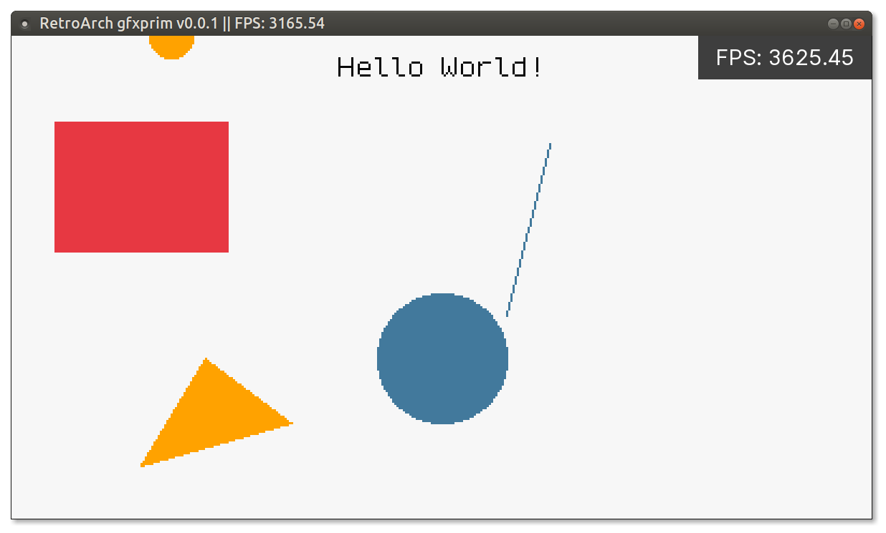

# libretro-gfxprim

Perhaps a [gfxprim](https://github.com/gfxprim/gfxprim) libretro backend core?



``` c
static void render(gp_pixmap* pixmap) {
	gp_pixel black = gp_rgb_to_pixmap_pixel(10, 10, 10, pixmap);
	gp_pixel red = gp_rgb_to_pixmap_pixel(230, 57, 70, pixmap);
	gp_pixel white = gp_rgb_to_pixmap_pixel(245, 245, 245, pixmap);
	gp_pixel blue = gp_rgb_to_pixmap_pixel(69, 123, 157, pixmap);
	gp_pixel orange = gp_rgb_to_pixmap_pixel(255, 161, 0, pixmap);

	gp_fill(pixmap, white);

	gp_fill_rect(pixmap, 100, 100, 20, 40, red);
	gp_fill_circle(pixmap, 200, 150, 30, blue);
	gp_line(pixmap, 250, 50, 230, 130, blue);
	gp_fill_triangle(pixmap, 60, 200, 130, 180, 90, 150, orange);

	gp_text(pixmap, NULL, pixmap->w / 2, 10, GP_ALIGN_CENTER | GP_VALIGN_BELOW, black, 0, "Hello World!");

	gp_fill_circle(pixmap, core.mouseX, core.mouseY, 10, core.mouseLeft == 1 ? red : orange);
}
```

## Compile

1. Ensure dependencies are available:
	- Python

2. Clone the code:
    ```
	git clone --recursive https://github.com/RobLoach/libretro-gfxprim.git
	cd libretro-gfxprim
	```

3. Compile
	```
	make
	```
4. Run
    ```
	retroarch -L gfxprim_libretro.so
	```
